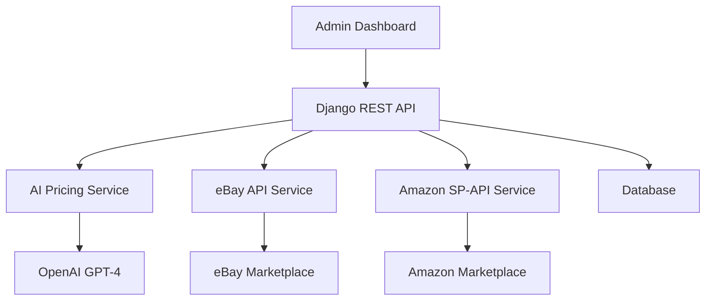

# 🚀 Auto-Market: AI-Powered Marketplace Automation Platform

<div align=\"center\">


**Transform your products into profitable listings with AI-powered pricing and automated marketplace management**

[](https://djangoproject.com/)
[](https://python.org/)
[](https://developer.ebay.com/)
[](https://developer-docs.amazon.com/sp-api/)
[](https://openai.com/)

[🚀 Quick Start](#-quick-start) • [✨ Features](#-features) • [🛠️ Setup](#️-installation--setup) • [📚 Documentation](#-api-documentation) • [🤝 Support](#-support)

</div>

---

## 🎯 What is Auto-Market?

Auto-Market is a **revolutionary Django-based platform** that automates your entire marketplace selling workflow. Upload product photos, get AI-powered pricing, and automatically list on eBay and Amazon with zero manual effort.

### 🧠 **AI-Powered Intelligence**
- **Smart Pricing**: GPT-4 analyzes market data to suggest optimal prices
- **Visual Recognition**: AI examines product photos to assess condition and authenticity
- **Market Research**: Real-time analysis of eBay sold listings and marketplace trends
- **Category Detection**: Automatically categorizes products for proper listing placement

### 🏪 **Multi-Marketplace Management**
- **eBay Integration**: Full API integration with inventory, offers, and listing management
- **Amazon SP-API**: Complete Amazon marketplace automation with catalog management
- **Unified Dashboard**: Manage all platforms from one beautiful admin interface
- **Real-time Sync**: Price updates automatically sync across all platforms

---

## ✨ Features

### 🤖 **AI Product Analysis**
```
📸 Upload Photos → 🧠 AI Analysis → 💰 Smart Pricing → 🚀 Auto-List
```

- **📱 Multi-Image Analysis**: Upload up to 8 product photos
- **💡 Intelligent Pricing**: GPT-4 analyzes condition, market trends, and comparable sales
- **🔍 Defect Detection**: AI identifies wear, damage, and condition issues
- **📊 Price Range Suggestions**: Get min/max pricing with confidence ratings
- **🏷️ Category Mapping**: Auto-assigns eBay/Amazon categories

### 🛒 **Marketplace Automation**

#### eBay Integration
- ✅ **One-Click Listing**: Automatic inventory creation and offer publishing
- ✅ **Category Optimization**: Smart category selection with required aspects
- ✅ **Business Policies**: Integrated payment, shipping, and return policies
- ✅ **Real-time Updates**: Price changes sync immediately
- ✅ **OAuth 2.0 Security**: Secure token-based authentication

#### Amazon SP-API
- ✅ **Product Catalog**: Create new ASINs or match existing products
- ✅ **Inventory Management**: Automated stock level updates
- ✅ **Brand Registry**: Support for brand-registered products
- ✅ **AWS Integration**: Secure SigV4 authentication
- ✅ **Multi-Marketplace**: Support for US, UK, EU, and more

### 🎛️ **Admin Dashboard**

<details>
<summary><strong>📊 Comprehensive Management Interface</strong></summary>

- **📈 Dashboard Analytics**: Revenue tracking, listing performance, sold items
- **📋 Product Management**: Bulk approve, reject, list, and price updates
- **🔄 Status Workflows**: PENDING → APPROVED → LISTED → SOLD
- **💰 Price Controls**: Update pricing with automatic marketplace sync
- **👥 Customer Management**: Contact info, pickup scheduling, batch processing
- **📧 Email Notifications**: Automated customer communication
- **🏪 Multi-Platform View**: See eBay and Amazon status side-by-side

</details>

### 🔧 **Developer Features**

- **🚀 RESTful API**: Complete API for mobile apps and integrations
- **📱 WebSocket Support**: Real-time updates with Django Channels
- **🔐 JWT Authentication**: Secure API access with refresh tokens
- **📝 Comprehensive Logging**: Detailed API call tracking and error monitoring
- **⚡ Async Processing**: Background tasks for heavy operations
- **🧪 Test Coverage**: Extensive testing suite with marketplace mocking

---

## 🚀 Quick Start

### Prerequisites
- 🐍 Python 3.11+
- 🗄️ SQLite (included) or PostgreSQL (production)
- 🔑 API keys (eBay, Amazon, OpenAI)
- 📧 Email service (Resend recommended)

### ⚡ 5-Minute Setup

```bash
# 1. Clone the repository
git clone https://github.com/yourusername/auto-market.git
cd auto-market

# 2. Create virtual environment
python -m venv venv
source venv/bin/activate  # On Windows: venv\\Scripts\\activate

# 3. Install dependencies
pip install -r requirements.txt

# 4. Configure environment
cp .env.example .env
# Edit .env with your API keys (see setup guide below)

# 5. Setup database
python manage.py migrate
python manage.py createsuperuser

# 6. Start development server
python manage.py runserver
```

🎉 **You're ready!** Visit `http://localhost:8000/admin` to start managing products!

---

## 🛠️ Installation & Setup

### 🔧 **Detailed Configuration Guide**

<details>
<summary><strong>🔑 API Keys Setup</strong></summary>

#### 1. OpenAI API (Required for AI Pricing)
```bash
# Get your API key from: https://platform.openai.com/api-keys
OPENAI_API_KEY=sk-your-openai-api-key-here
```

#### 2. eBay Developer Account
```bash
# Register at: https://developer.ebay.com/
# Create an app and get:
EBAY_CLIENT_ID=your-ebay-client-id
EBAY_CLIENT_SECRET=your-ebay-client-secret
EBAY_DEV_ID=your-ebay-developer-id
```

#### 3. Amazon SP-API Setup
```bash
# More complex setup - requires:
# - Amazon Seller Central account
# - SP-API application registration
# - AWS IAM role configuration
# See: https://developer-docs.amazon.com/sp-api/
```

#### 4. Email Service (Resend)
```bash
# Sign up at: https://resend.com
RESEND_API_KEY=re_your-resend-api-key-here
```

</details>

<details>
<summary><strong>🗄️ Database Configuration</strong></summary>

#### Development (SQLite - Default)
```python
# No configuration needed - works out of the box
```

#### Production (PostgreSQL)
```bash
# Install PostgreSQL
sudo apt-get install postgresql postgresql-contrib

# Create database
sudo -u postgres createdb automarket_db
sudo -u postgres createuser automarket_user

# Add to .env
DB_ENGINE=django.db.backends.postgresql
DB_NAME=automarket_db
DB_USER=automarket_user
DB_PASSWORD=your-secure-password
DB_HOST=localhost
DB_PORT=5432
```

</details>

<details>
<summary><strong>🚀 Production Deployment</strong></summary>

#### Using Docker (Recommended)
```dockerfile
# Dockerfile included - customize as needed
docker build -t auto-market .
docker run -p 8000:8000 auto-market
```

#### Manual Deployment
```bash
# Install production dependencies
pip install gunicorn whitenoise

# Collect static files
python manage.py collectstatic

# Run with Gunicorn
gunicorn auto_market.wsgi:application --bind 0.0.0.0:8000
```

</details>

---

## 📚 API Documentation

### 🔐 **Authentication**
```python
# Get JWT tokens
POST /api/auth/login/
{
    \"email\": \"admin@example.com\",
    \"password\": \"your-password\"
}

# Response
{
    \"access\": \"eyJ0eXAiOiJKV1QiLCJhbGci...\",
    \"refresh\": \"eyJ0eXAiOiJKV1QiLCJhbGci...\"
}
```

### 📦 **Product Management**

<details>
<summary><strong>🛍️ Core Product Endpoints</strong></summary>

```python
# List all products
GET /api/admin/products/

# Get product details
GET /api/admin/products/{id}/

# Update product status (approve, list, etc.)
POST /api/admin/products/{id}/update-status/
{
    \"action\": \"list\",
    \"final_price\": 299.99
}

# Update product price
POST /api/admin/products/{id}/update-price/
{
    \"final_price\": 249.99
}

# Get dashboard statistics
GET /api/admin/dashboard/stats/
```

</details>

<details>
<summary><strong>🤖 AI Pricing Endpoints</strong></summary>

```python
# Get AI price estimate
POST /api/ai/estimate-price/
{
    \"item_name\": \"iPhone 13 Pro 256GB\",
    \"description\": \"Excellent condition, no scratches\",
    \"condition\": \"EXCELLENT\",
    \"defects\": \"\",
    \"images\": [\"image1.jpg\", \"image2.jpg\"],
    \"pickup_address\": \"New York, NY\"
}

# Response
{
    \"estimated_price\": 599.99,
    \"currency\": \"USD\",
    \"confidence\": \"HIGH\",
    \"price_range_min\": 549.99,
    \"price_range_max\": 649.99
}
```

</details>

<details>
<summary><strong>🏪 Marketplace Integration</strong></summary>

```python
# List product on eBay/Amazon
POST /api/admin/products/{id}/list-marketplace/
{
    \"platform\": \"BOTH\"  # or \"EBAY\" or \"AMAZON\"
}

# Get marketplace categories
GET /api/marketplace/categories/?title=iPhone&platform=EBAY

# Check marketplace status
GET /api/admin/marketplace/status/
```

</details>

### 📊 **Response Format**
```json
{
    \"success\": true,
    \"message\": \"Product listed successfully\",
    \"data\": {
        \"product_id\": 123,
        \"ebay_listing_id\": \"123456789\",
        \"amazon_asin\": \"B08N5WRWNW\"
    }
}
```

---

## 🏗️ Architecture

### 🧩 **System Components**



### 📁 **Project Structure**
```
auto-market/
├── 🎛️ api/                     # Main API application
│   ├── 🧠 ai_service.py        # OpenAI integration
│   ├── 🛒 ebay_service.py       # eBay API wrapper
│   ├── 📦 marketplace_service.py # Marketplace abstraction
│   ├── 👥 admin_views.py        # Admin API endpoints
│   ├── 📊 admin_serializers.py  # Data validation
│   └── 🗄️ models.py            # Database models
├── 🔐 authentications/         # User management
├── ⚙️ auto_market/              # Django settings
├── 📁 media/                   # Product images
├── 📄 requirements.txt         # Dependencies
├── 🔧 .env.example            # Configuration template
└── 📚 README.md               # This file!
```

### 🔄 **Data Flow**

1. **📸 Product Submission**: User uploads photos and basic info
2. **🧠 AI Analysis**: GPT-4 analyzes images and suggests pricing
3. **👨‍💼 Admin Review**: Admin approves/rejects with price adjustments
4. **🚀 Auto-Listing**: System creates listings on eBay and Amazon
5. **📊 Monitoring**: Real-time sync of prices and inventory
6. **💰 Sale Management**: Track sales across all platforms

---

## 🧪 Testing

### 🔬 **Run Test Suite**
```bash
# Run all tests
python manage.py test

# Test specific components
python manage.py test api.tests.test_marketplace
python manage.py test api.tests.test_ai_service

# Test with coverage
coverage run manage.py test
coverage report
```

### 🎭 **Mock Testing**
The project includes comprehensive mocking for:
- eBay API responses
- Amazon SP-API calls
- OpenAI pricing requests
- Email service integration

---

## 🚀 Deployment

### 🐳 **Docker Deployment**
```yaml
# docker-compose.yml
version: '3.8'
services:
  web:
    build: .
    ports:
      - \"8000:8000\"
    environment:
      - DEBUG=False
      - DATABASE_URL=postgres://user:pass@db:5432/automarket
  
  db:
    image: postgres:15
    environment:
      POSTGRES_DB: automarket
      POSTGRES_USER: user
      POSTGRES_PASSWORD: pass
```

### ☁️ **Cloud Deployment Options**

<details>
<summary><strong>🌊 Heroku</strong></summary>

```bash
# Install Heroku CLI and login
heroku create your-app-name
heroku addons:create heroku-postgresql:mini
heroku config:set DEBUG=False
# Set all your environment variables
heroku config:set OPENAI_API_KEY=your-key
git push heroku main
heroku run python manage.py migrate
```

</details>

<details>
<summary><strong>☁️ AWS/Digital Ocean</strong></summary>

```bash
# Use provided deploy scripts
./deploy/setup_server.sh
./deploy/deploy_production.sh
```

</details>

---

## 🔧 Configuration

### 🎛️ **Environment Variables**

| Category | Variable | Description | Required |
|----------|----------|-------------|----------|
| 🧠 **AI** | `OPENAI_API_KEY` | OpenAI API key for pricing | ✅ |
| 🛒 **eBay** | `EBAY_CLIENT_ID` | eBay application client ID | ✅ |
| 🛒 **eBay** | `EBAY_CLIENT_SECRET` | eBay application secret | ✅ |
| 📦 **Amazon** | `AMAZON_CLIENT_ID` | Amazon SP-API client ID | ✅ |
| 📦 **Amazon** | `AWS_ACCESS_KEY_ID` | AWS access key for SP-API | ✅ |
| 📧 **Email** | `RESEND_API_KEY` | Resend email service key | ✅ |
| 🔐 **Security** | `SECRET_KEY` | Django secret key | ✅ |
| 🌍 **General** | `DEBUG` | Development mode | ❌ |

### 🔒 **Security Checklist**

- ✅ Never commit `.env` files
- ✅ Use strong secret keys (50+ characters)
- ✅ Enable HTTPS in production
- ✅ Set `DEBUG=False` in production
- ✅ Configure proper CORS origins
- ✅ Use environment-specific API endpoints
- ✅ Regularly rotate API keys
- ✅ Monitor API usage and rate limits

---

## 🎯 Use Cases

### 🏪 **Reseller Businesses**
> *\"Auto-Market helped us scale from 10 to 1000 listings per month with 90% less manual work\"*

- **Thrift Store Automation**: Upload photos, get instant pricing, list everywhere
- **Estate Sale Management**: Process large inventories quickly
- **Electronics Flipping**: AI detects authenticity and optimal pricing

### 👥 **Individual Sellers**
> *\"I make an extra $2000/month selling items I find at garage sales\"*

- **Declutter & Profit**: Turn household items into cash
- **Hobby Monetization**: Sell collectibles, crafts, vintage finds
- **Side Hustle**: Part-time reselling with full-time results

### 🏢 **Small Businesses**
> *\"Our online sales increased 300% after implementing Auto-Market\"*

- **Inventory Liquidation**: Clear old stock efficiently
- **Multi-Channel Selling**: Expand to new marketplaces easily
- **Price Optimization**: AI ensures competitive pricing

---

## 🛣️ Roadmap

### 🎯 **Next Release (v2.0)**
- 🔄 **Automated Repricing**: Dynamic price adjustments based on market changes
- 📱 **Mobile App**: iOS/Android app for on-the-go management
- 🏷️ **Barcode Scanning**: Instant product identification
- 📊 **Advanced Analytics**: Profit tracking, market insights, performance metrics

### 🔮 **Future Features**
- 🌐 **Additional Marketplaces**: Etsy, Facebook, Poshmark integration
- 🤖 **AI Descriptions**: Auto-generate compelling product descriptions
- 📦 **Inventory Management**: Stock tracking across all platforms
- 💬 **ChatBot Integration**: AI customer service for inquiries
- 🔔 **Smart Notifications**: Predictive alerts for pricing and inventory

---

## 🤝 Contributing

We welcome contributions! Here's how to get started:

### 🛠️ **Development Setup**
```bash
# Fork the repository
git fork https://github.com/yourusername/auto-market

# Create feature branch
git checkout -b feature/amazing-feature

# Make changes and test
python manage.py test

# Commit with conventional commits
git commit -m \"feat: add amazing feature\"

# Push and create PR
git push origin feature/amazing-feature
```

### 📋 **Contribution Guidelines**
- 🧪 Write tests for new features
- 📝 Update documentation
- 🎨 Follow PEP 8 style guidelines
- 💬 Use conventional commit messages
- 🔍 Ensure CI/CD passes

---

## 📞 Support

### 🆘 **Getting Help**

- 📚 **Documentation**: Check this README and inline code comments
- 🐛 **Bug Reports**: [Create an issue](https://github.com/yourusername/auto-market/issues)
- 💡 **Feature Requests**: [Start a discussion](https://github.com/yourusername/auto-market/discussions)
- 💬 **Community**: Join our [Discord server](https://discord.gg/automarket)
- 📧 **Direct Support**: [support@automarket.dev](mailto:support@automarket.dev)

### 🔧 **Common Issues**

<details>
<summary><strong>❌ eBay Authentication Errors</strong></summary>

**Problem**: `Invalid client credentials`

**Solution**:
1. Verify your eBay API keys in `.env`
2. Check if using sandbox vs production endpoints
3. Ensure your eBay app has proper scopes enabled
4. Regenerate your user token if expired

</details>

<details>
<summary><strong>❌ Amazon SP-API 403 Errors</strong></summary>

**Problem**: `Access to requested resource is denied`

**Solution**:
1. Verify AWS IAM role permissions
2. Check if your SP-API application is approved
3. Ensure correct marketplace ID for your region
4. Validate AWS signature v4 configuration

</details>

<details>
<summary><strong>❌ OpenAI Rate Limits</strong></summary>

**Problem**: `Rate limit exceeded`

**Solution**:
1. Check your OpenAI usage limits
2. Implement request queuing for high-volume usage
3. Consider upgrading your OpenAI plan
4. Add retry logic with exponential backoff

</details>

### 📈 **Performance Tips**

- 🚀 Use Redis for caching in production
- 📊 Monitor API rate limits and usage
- 🗄️ Use PostgreSQL for better performance
- 📱 Implement pagination for large datasets
- ⚡ Use async tasks for heavy operations

---

## 📄 License

```
MIT License

Copyright (c) 2024 Auto-Market

Permission is hereby granted, free of charge, to any person obtaining a copy
of this software and associated documentation files (the \"Software\"), to deal
in the Software without restriction, including without limitation the rights
to use, copy, modify, merge, publish, distribute, sublicense, and/or sell
copies of the Software, and to permit persons to whom the Software is
furnished to do so, subject to the following conditions:

The above copyright notice and this permission notice shall be included in all
copies or substantial portions of the Software.

THE SOFTWARE IS PROVIDED \"AS IS\", WITHOUT WARRANTY OF ANY KIND, EXPRESS OR
IMPLIED, INCLUDING BUT NOT LIMITED TO THE WARRANTIES OF MERCHANTABILITY,
FITNESS FOR A PARTICULAR PURPOSE AND NONINFRINGEMENT. IN NO EVENT SHALL THE
AUTHORS OR COPYRIGHT HOLDERS BE LIABLE FOR ANY CLAIM, DAMAGES OR OTHER
LIABILITY, WHETHER IN AN ACTION OF CONTRACT, TORT OR OTHERWISE, ARISING FROM,
OUT OF THE SOFTWARE OR THE USE OR OTHER DEALINGS IN THE SOFTWARE.
```

---

## 🙏 Acknowledgments

- 🤖 **OpenAI** for providing incredible AI pricing capabilities
- 🛒 **eBay Developers** for comprehensive API documentation
- 📦 **Amazon SP-API Team** for marketplace integration support
- 🐍 **Django Community** for the amazing framework
- 🎨 **Contributors** who make this project better every day

---

<div align=\"center\">

### 🌟 **Star this repo if Auto-Market helps your business!** ⭐

**Made with ❤️ by the Auto-Market Team**

[🐛 Report Bug](https://github.com/yourusername/auto-market/issues) • [✨ Request Feature](https://github.com/yourusername/auto-market/issues) • [💬 Join Community](https://discord.gg/automarket)

---

*Auto-Market: Where AI meets marketplace automation* 🚀

</div>"